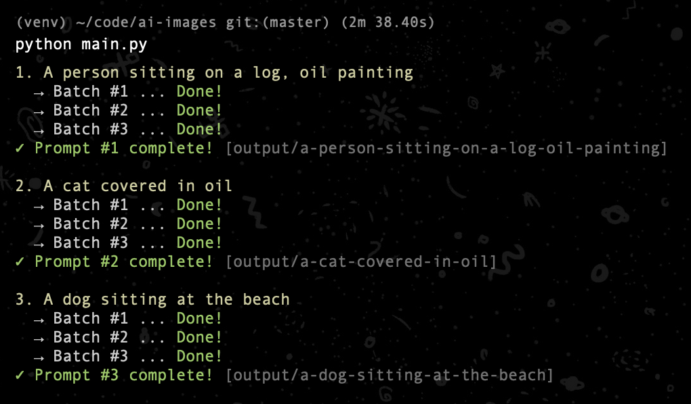
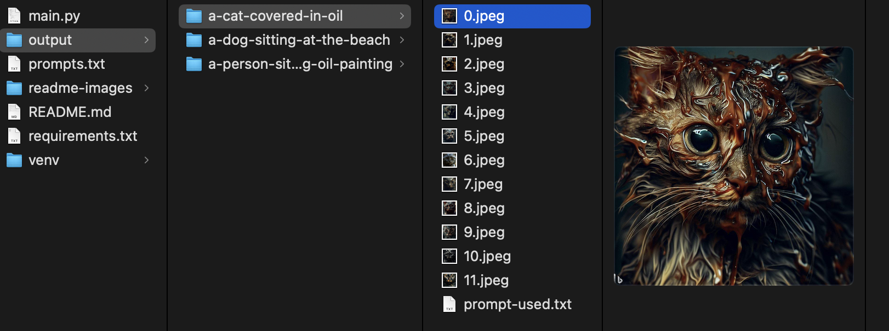

# Introduction

This script reads multiple prompts from a txt file and saves the images to a folder. It's useful for bulk-generating images with the Bing Image AI.

This is based off [acheong08/BingImageCreator](https://github.com/acheong08/BingImageCreator), which allows you to use the Bing Image AI from your CLI / in python.

**This** script, on the other hand, utilizies that library to mass-generate images, and you can also specifiy the number of batches (one batch = 4 images) to generate per prompt.

# Setup

## Install dependencies

(_Tested using Python 3.9.6 with venv on macOS_)

You have to install the requirements listed in `requirements.txt`.

```bash
pip install -r requirements.txt
```

_If you're not using some type of virtual environment for python (although recommended), you might have to use `pip3` instead of `pip`, if `pip3` is your python3 pip._

## Get auth token

Please refer to the [acheong08/BingImageCreator README](https://github.com/acheong08/BingImageCreator) to get your auth token.

## Set auth token

Next up, copy `.env.example` to `.env` and set your auth token (+ other settings if you'd like to)

## Set prompts

Put your prompts in the prompts file, which is `prompts.txt` per default, but you can change that in the `.env` file.
Put one prompt per line.

## Running the script

```bash
python main.py
```

_Again, you might have to use `python3` instead of `python`, depending on your setup._

# Example

`prompts.txt`:

```text
A person sitting on a log, oil painting
A cat covered in oil
A dog sitting at the beach
```

I set the number of batches (in the `.env`) to 3, (at 4 images per batch, which is what the Bing AI generates per request), so I get 12 images in total per prompt.

Terminal output _(with pretty colors)_:

Generated images (+ folder structure):

